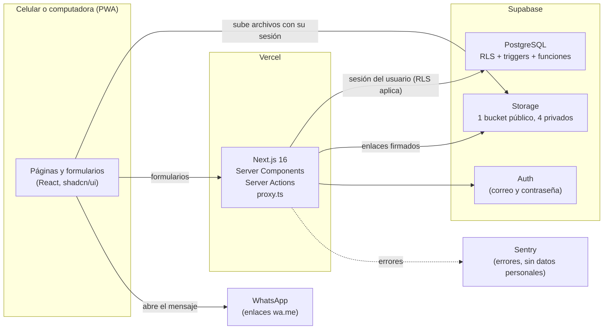

# Arquitectura

Documento para quien mantenga el sistema. Las decisiones y sus razones están en
`specs/001-recolectora-fase1/research.md`; el modelo de datos en `data-model.md` y los contratos en
`contracts/` de esa misma carpeta.

## Componentes



- No hay backend propio: Supabase guarda los datos, los archivos y las cuentas; Next.js muestra
  las pantallas y recibe los formularios.
- **La seguridad vive en la base de datos.** Cada tabla tiene RLS; los cambios de estado los
  validan triggers. Aunque alguien llame a la API sin pasar por las pantallas, no puede ver ni
  cambiar lo que no le toca.

## Carpetas

```text
src/
├── app/                 rutas (URLs en español): (public), mi-cuenta, bazar, admin, auth/callback
├── features/<área>/     todo lo de una parte del negocio:
│   ├── schemas.ts       validación (Zod), igual en el navegador y en el servidor
│   ├── actions.ts       Server Actions (escrituras)
│   ├── queries.ts       lecturas para las páginas
│   ├── service.ts       reglas que usan las acciones y las pruebas (paquetes, bazares, eliminación)
│   ├── labels.ts        textos en español de cada estado
│   └── components/      formularios y piezas de pantalla
├── lib/
│   ├── supabase/        clientes (server, client, proxy) y admin.ts (service role, ver abajo)
│   ├── notifications/   único módulo que conoce WhatsApp
│   ├── uploads/         compresión, rutas y subida de archivos
│   ├── validation/      teléfonos, códigos y mensajes de error en español
│   └── auth/            sesión y roles
└── proxy.ts             refresca la sesión y manda a cada rol a su sección
supabase/
├── migrations/          esquema completo, en orden
├── seed.sql             datos ficticios para desarrollo
└── scripts/             find-orphan-files.sql, seed-volume.sql (manuales)
tests/                   unit, integration (contra Supabase local) y e2e (Playwright)
```

## Patrón de escritura: Server Action + Zod + RLS

Todas las escrituras siguen los mismos pasos:

1. El formulario valida con el esquema Zod de `features/<área>/schemas.ts`.
2. Si hay archivo, el navegador lo comprime y lo sube a Storage **con la sesión del usuario**
   (`lib/uploads/upload.ts`) y obtiene su ruta.
3. Llama a la Server Action, que vuelve a validar con el mismo esquema, comprueba el rol
   (`authorize()`) y que la ruta del archivo esté en la carpeta correcta.
4. La acción escribe con el cliente de Supabase **del usuario**: RLS y los triggers deciden.
5. Devuelve `ActionResult` (`{ ok: true, data }` o `{ ok: false, error }` con el mensaje en
   español).

Las reglas de paquetes, bazares y eliminación están en `service.ts` (funciones que reciben el
cliente de Supabase), para que las pruebas de integración las ejecuten con cada rol.

## Máquinas de estado

- **Pedidos**: la tabla `order_status_transitions` lista los cambios permitidos y quién puede
  hacerlos; el trigger `validate_order_update()` la consulta (con `order_transition_allowed()`,
  research R24). La misma tabla existe en `src/features/orders/status.ts` y una prueba verifica
  que coincidan. Pagos, paquetes y envíos mueven el pedido solos mediante triggers
  (`sync_order_from_*`).
- **Bazares**: `validate_bazaar_update()` valida transiciones, exige ficha, 4 documentos y 3
  referencias para enviar a revisión, y descarta propuestas al suspender.
- **Propuestas y documentos de bazar**: la versión publicada vive en `bazaars` y `bazaar_photos`;
  el bazar solo escribe propuestas y documentos "en revisión". La recolectora los publica con
  `apply_bazaar_proposal()`, `approve_bazaar_document()` y `reject_bazaar_document()`.

## Archivos y enlaces firmados

| Bucket                     | Público | Quién lee                                              |
| -------------------------- | ------- | ------------------------------------------------------ |
| `bazaar-photos`            | sí      | todos (solo fotos autorizadas)                         |
| `bazaar-photo-submissions` | no      | el bazar dueño y la recolectora (60 min)               |
| `bazaar-documents`         | no      | solo la recolectora (10 min)                           |
| `payment-proofs`           | no      | solo la recolectora (10 min)                           |
| `package-photos`           | no      | la clienta dueña del paquete y la recolectora (60 min) |

- Los enlaces se crean en el servidor **con la sesión de quien los pide**, así las políticas de
  `storage.objects` deciden (ver `contracts/storage.md`).
- Al autorizar fotos de un bazar se copian del bucket privado al público y se borra la copia
  privada.
- Borrar un archivo requiere poder leerlo. Como el bazar no puede leer sus documentos, cuando
  reemplaza uno en revisión la ruta va a `storage_trash` y se borra con la sesión de la
  recolectora en su siguiente revisión (research R23).

### Archivos huérfanos

Si una acción falla después de subir un archivo, el archivo queda sin usar. Para encontrarlos,
ejecuta `supabase/scripts/find-orphan-files.sql` en el editor SQL de Supabase (por ejemplo, una
vez al mes). Solo lista archivos de más de un día; bórralos desde **Storage** en el panel de
Supabase (Supabase no permite borrar archivos con SQL).

## Notificaciones (WhatsApp)

`src/lib/notifications/` es el único lugar que conoce WhatsApp:

- `messages.ts`: arma el texto con las plantillas de `settings` (una línea cuya variable no tiene
  valor se omite, por ejemplo el enlace para clientas sin cuenta).
- `whatsapp-link.ts`: el canal de la fase 1, que devuelve un enlace `https://wa.me/52…?text=…`.
- `index.ts`: `notify()` arma el mensaje, lo guarda en `notifications` y llama al canal activo.

**Para la fase 2 (WhatsApp Cloud API):** crear `whatsapp-cloud.ts` que implemente
`NotificationChannel` y devuelva `{ kind: "sent", providerId }`, cambiar
`getNotificationChannel()` en `index.ts` y agregar `whatsapp_cloud` al enum
`notification_channel`. Las pantallas ya manejan los dos tipos de resultado
(`components/open-whatsapp.tsx`).

## Dónde se usa la service role key y por qué

La service role key ignora RLS, así que se usa en un solo archivo: `src/lib/supabase/admin.ts`
(marcado `server-only`; una regla de ESLint impide importarlo fuera de
`src/features/account-deletion/`). Solo expone dos operaciones que no se pueden hacer con la
sesión del usuario al eliminar una cuenta (research R16):

1. Borrar archivos de Storage de otra persona.
2. Borrar el usuario de Auth.

Antes, la acción ejecuta `anonymize_customer()` o `anonymize_bazaar()` **con la sesión normal**,
que comprueba que quien llama es la dueña o la recolectora. Fuera de la app, la llave solo se usa
en las pruebas y scripts locales.

## Privacidad y monitoreo

- Sentry recibe errores sin datos personales: `sentry.privacy.ts` desactiva usuario, cookies,
  encabezados, cuerpos, parámetros de URL, consultas y variables; Session Replay está apagado.
- La clienta solo lee de la configuración el monto y los datos para pagar (`get_payment_info()`).

## Rendimiento (T154)

Medido el 2026-10-04 en local con `supabase/scripts/seed-volume.sql` cargado (1,040 clientas,
3,049 pedidos, 2,892 pagos, 5,155 paquetes, 217 bazares aprobados).

**Consultas** (`EXPLAIN ANALYZE`, con RLS como la recolectora o como visitante):

| Consulta                                                   | Tiempo |
| ---------------------------------------------------------- | ------ |
| Directorio `search_directory('zara')` (visitante)          | 3.7 ms |
| Lista de pedidos (200 más recientes)                       | 3.1 ms |
| Búsqueda de clienta por teléfono parcial (`find_customer`) | 1.6 ms |
| Pedidos filtrados por nombre de clienta                    | 1.6 ms |
| Pagos pendientes                                           | 1.3 ms |
| Contador de paquetes sin asignar                           | 0.2 ms |

**Páginas** (build de producción, perfil Pixel 7, CPU 4× más lenta, sin caché):

| Página                  | Interactiva | Carga completa | Transferido |
| ----------------------- | ----------- | -------------- | ----------- |
| `/`                     | 0.27 s      | 0.57 s         | 325 KB      |
| `/mi-cuenta`            | 0.26 s      | 0.67 s         | 428 KB      |
| `/admin`                | 0.26 s      | 0.54 s         | 311 KB      |
| `/admin/paquetes/nuevo` | 0.26 s      | 0.64 s         | 406 KB      |
| `/admin/pedidos`        | 0.27 s      | 0.56 s         | 329 KB      |

La emulación de latencia de red no se aplica a `localhost`; con 4G real (≈9 Mbps, 70 ms) la página
más pesada (428 KB) se estima en 1–1.5 s, por debajo de la meta de 3 s.

**Pendiente de medir con el despliegue real** (no se puede en local): registro de un paquete con
cronómetro desde un celular real (meta SC-001: menos de 1 minuto) y Lighthouse móvil sobre la URL
de Vercel.
