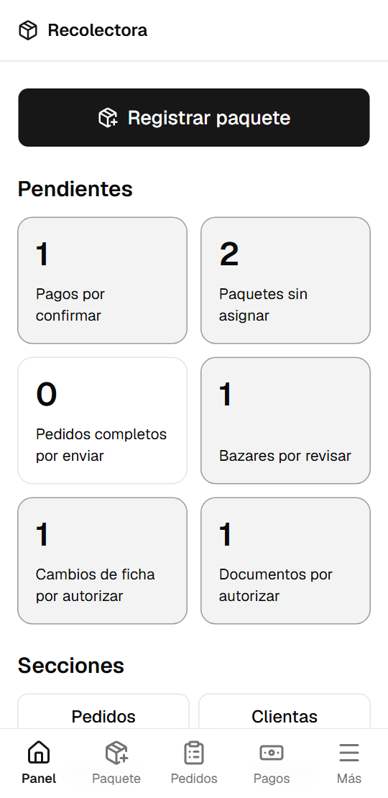
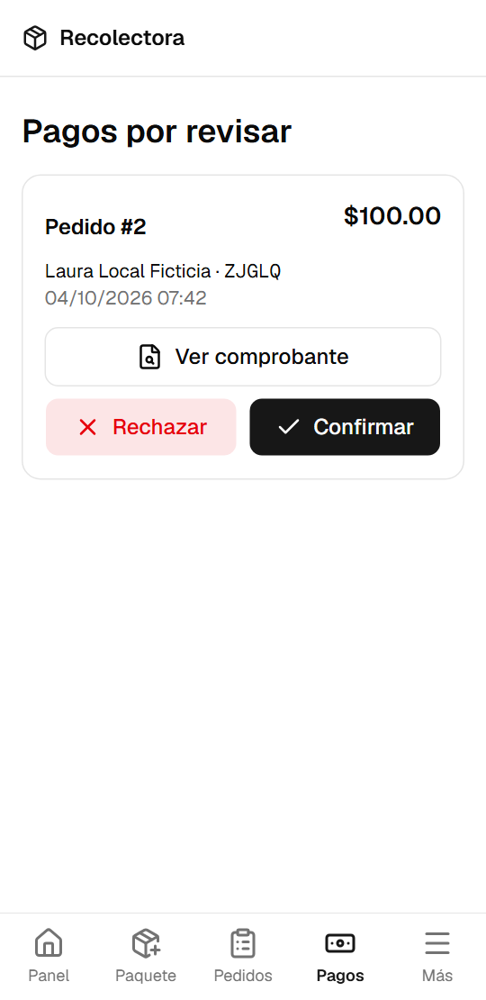
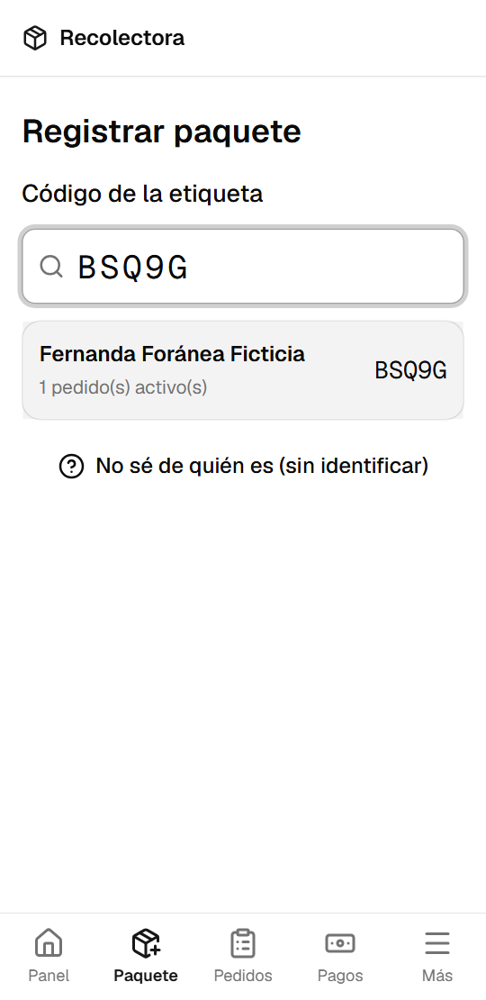
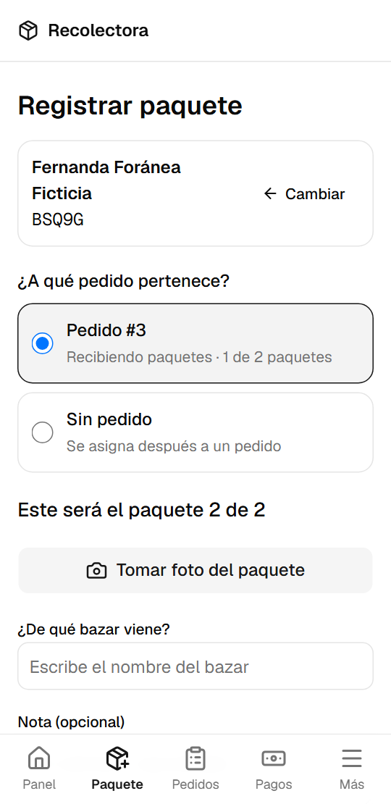
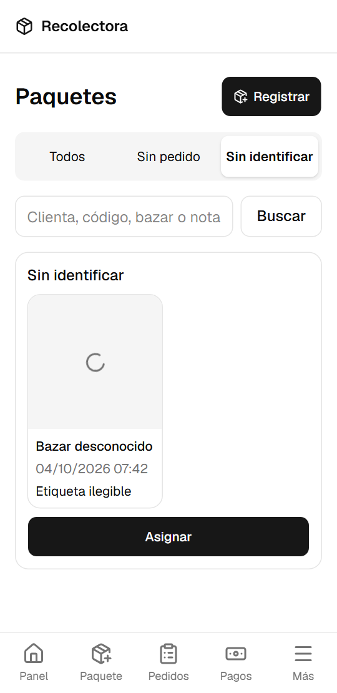
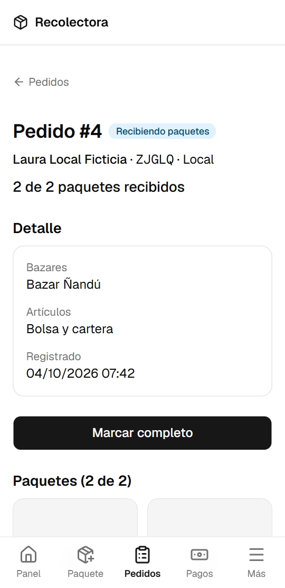
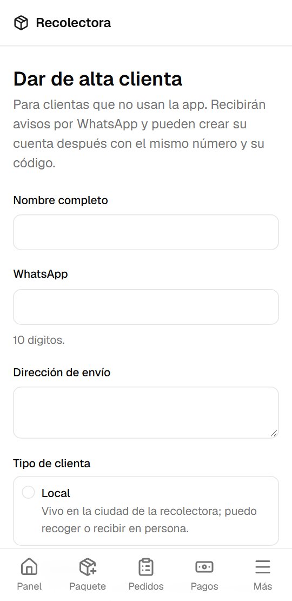
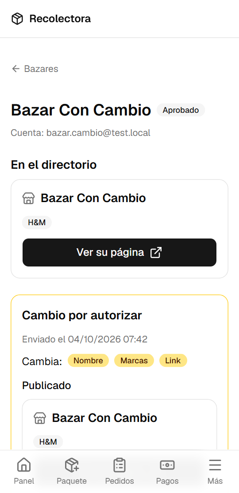
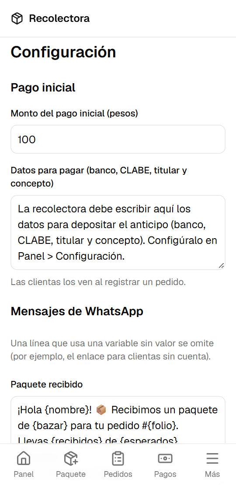
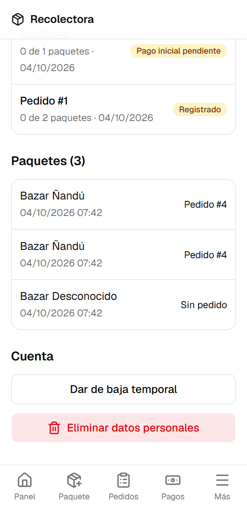

# Manual de la recolectora

Guía para usar el Sistema Recolectora desde tu celular. Todo lo de este manual también funciona en
una computadora.

## 1. Instalar la app en tu celular

La app se abre desde el navegador y se puede agregar a la pantalla de inicio para usarla como una
app normal.

- **Android (Chrome)**: abre la dirección de la app, toca el menú **⋮** y elige **Agregar a la
  pantalla principal** (o **Instalar app**).
- **iPhone (Safari)**: abre la dirección de la app, toca **Compartir** (el cuadro con la flecha
  hacia arriba) y elige **Agregar a inicio**.

Entra con tu correo y contraseña. Si la olvidas, toca **Olvidé mi contraseña** en la pantalla de
entrada y sigue el enlace que llega a tu correo.

## 2. El panel

Al entrar ves:

- El botón grande **Registrar paquete**, para lo que más haces en el día.
- **Pendientes**: cuántos pagos, paquetes sin asignar, pedidos por enviar, bazares y cambios
  esperan tu atención. Toca un recuadro para ir directo a esa lista.
- Abajo, la barra con **Panel**, **Paquete**, **Pedidos**, **Pagos** y **Más** (clientas,
  bazares, envíos y configuración).

## 3. Revisar pagos

En **Pagos** aparece cada comprobante que subió una clienta.

1. Toca **Ver comprobante**. Se abre el archivo con un enlace que dura 10 minutos.
2. Si el depósito llegó, toca **Confirmar**. Si no, toca **Rechazar** y escribe el motivo (la
   clienta lo verá y podrá subir otro comprobante).
3. Se abre WhatsApp con el mensaje ya escrito para la clienta. Solo toca **Enviar**.

Si WhatsApp no abre, usa **Copiar mensaje** y pégalo en el chat de la clienta.

## 4. Registrar un paquete

1. Toca **Paquete** en la barra de abajo.
2. Escribe el **código** que viene en la etiqueta (por ejemplo `K7M4P`). No importa si lo escribes
   en minúsculas o con espacios. También puedes buscar por nombre o teléfono.
3. Toca a la clienta.

4. Si la clienta tiene un solo pedido activo, ya aparece marcado. Si tiene varios, elige el
   correcto. Verás "Este será el paquete N de M".
5. Toca **Tomar foto del paquete** (se abre la cámara).
6. Escribe de qué bazar viene y, si quieres, una nota.
7. Toca **Guardar paquete**. Se abre WhatsApp con el aviso para la clienta: qué llegó, cuántos
   lleva y el enlace para ver la foto. Toca **Enviar**.
8. Toca **Registrar otro paquete** para seguir.

Si la foto no se sube (por ejemplo, sin señal), el paquete no se guarda y tus datos se conservan
para que lo intentes de nuevo.

## 5. Paquetes sin pedido o sin identificar

- **Sin pedido**: si la clienta no tiene un pedido registrado, elige **Sin pedido** al
  registrarlo. Ella recibe un mensaje que le pide registrar su pedido.
- **Sin identificar**: si no puedes leer el código ni encontrar a la clienta, toca **No sé de
  quién es** antes de buscar. No se envía ningún mensaje.

Después, en **Más › Paquetes**, abre la pestaña **Sin pedido** o **Sin identificar** y toca
**Asignar** para elegir a la clienta y su pedido. Al asignarlo a un pedido se abre WhatsApp con el
aviso normal.

## 6. Cerrar y enviar un pedido

1. Abre el pedido (desde **Pedidos** o desde el panel).
2. Toca **Marcar completo**. Si llegaron menos paquetes de los esperados, la app te pregunta antes
   de continuar.
3. En **Registrar envío** elige el tipo:
   - **Paquetería**: escribe la paquetería, el número de guía y el costo.
   - **Entrega en persona** o **Recolección en persona** (solo para clientas locales): solo el
     costo, si lo hay.
4. Toca **Registrar envío**. Se abre WhatsApp con el aviso para la clienta.
5. Cuando la clienta lo reciba, abre el pedido y toca **Marcar entregado**.

En el mismo pedido puedes **mover un paquete** a otro pedido de la misma clienta, **reenviar un
aviso** de WhatsApp o **cancelar** el pedido con un motivo.

## 7. Clientas sin cuenta

Para clientas que no quieren usar la app:

1. **Más › Clientas › Nueva**: escribe nombre, WhatsApp, dirección y si es local o foránea.
2. Toca **Dar de alta**. Aparece su código y el botón **Compartir código por WhatsApp**.
3. Toca **Registrar pedido** para crear su pedido. Si ya te pagó, marca **Anotar pago inicial
   recibido** y escribe el monto (el comprobante es opcional).

Sus avisos de WhatsApp no llevan enlace. Si después ella se registra en la app con el mismo
WhatsApp y su código, ve todos sus pedidos.

## 8. Revisar bazares

En **Más › Bazares**:

- **Por revisar**: registros nuevos. Abre cada uno, revisa los datos públicos, las fotos, los
  documentos (botón **Ver**, enlace de 10 minutos) y las referencias (toca el teléfono para
  llamar). Toca **Aprobar** o **Rechazar** con un motivo.
- **Aprobados**: puedes **Suspender** (con motivo) un bazar; deja de aparecer en el directorio.
  Para volver a mostrarlo, ábrelo y toca **Reactivar**.

### Cambios de ficha y documentos nuevos

Cuando un bazar aprobado cambia su nombre, marcas, link o fotos, el directorio **no cambia** hasta
que lo autorices. En **Cambios por autorizar** abre el bazar: verás la versión publicada y la
propuesta lado a lado, con lo que cambia marcado. Toca **Autorizar** para publicarla o
**Rechazar** con un motivo.

Lo mismo con los documentos: el nuevo queda "En revisión" y el anterior sigue vigente. Compara con
**Ver vigente** y **Ver nuevo** y decide. Al autorizar, el anterior se borra para siempre.

## 9. Configuración y plantillas

En **Más › Configuración**:

- **Monto del pago inicial** y **datos para pagar** (banco, CLABE, titular y concepto). Las
  clientas los ven al registrar un pedido.
- **Mensajes de WhatsApp**: puedes cambiar el texto de cada aviso. Usa solo las variables que se
  indican, entre llaves, por ejemplo `{nombre}` o `{folio}`. Debajo de cada plantilla ves cómo se
  verá. Si escribes una variable que no existe, la app no te deja guardar.

## 10. Dar de baja o eliminar datos

En el detalle de una clienta (**Más › Clientas** y tócala):

- **Dar de baja temporal**: puede entrar y ver sus pedidos, pero no crear ni modificar nada.
  **Reactivar** la regresa a la normalidad.
- **Eliminar datos personales**: borra para siempre su nombre, WhatsApp, dirección, cuenta,
  comprobantes y fotos de paquetes. Sus pedidos en curso se cancelan con el motivo "Datos
  eliminados". El historial se conserva como "Clienta eliminada". Debes escribir **ELIMINAR**
  para confirmar.

En el detalle de un bazar también está **Eliminar datos personales**. La baja temporal de un bazar
es **Suspender**.

Las clientas y los bazares también pueden eliminar su propia cuenta desde la app. Una clienta con
pedidos en curso no puede hacerlo: la app le pide que te contacte para cerrarlos primero.

## Preguntas frecuentes

- **La clienta dice que no le llegó el mensaje.** Abre el pedido, entra a **Avisos enviados** y
  toca **Reenviar**.
- **Una clienta escribió mal su código muchas veces al registrarse.** Por seguridad se bloquea.
  Abre su detalle y toca **Desbloquear registro con su código**.
- **Me equivoqué de pedido al registrar un paquete.** Abre el pedido, busca el paquete y usa
  **Mover a…** para pasarlo al pedido correcto de la misma clienta.
